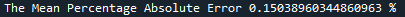
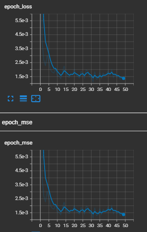

# COVID_19 Case Prediction in Malaysia
 Creating an LSTM model to predict COVID-19 cases in Malaysia

# Description
This repository contains 2 python files (new_case.py, modules.py).

new_case.py contains the codes to build a deep learning model and train on the dataset.

modules.py contains the codes where there are class and functions to be used in train.py.

#How run Tensorboard

1. Clone this repository and use the model.h5, mms_scaler.pkl (inside saved_model folder) to deploy on your dataset.
2. Run tensorboard at the end of training to see how well the model perform via Anaconda prompt. Activate the correct environment.
3. Type "tensorboard --logdir "the log path"
4. Paste the local network link into your browser and it will automatically redirected to tensorboard local host and done! Tensorboard is now can be analyzed.

# The Architecture of Model

# The Performance of model

# Tensorboard screenshot from my browser

# Discussion

# Credit
Big thanks to the owner of the datasets GitHub - MoH-Malaysia/covid19-public: Official data on the COVID-19 epidemic in Malaysia. Powered by CPRC, CPRC Hospital System, MKAK, and MySejahtera.
